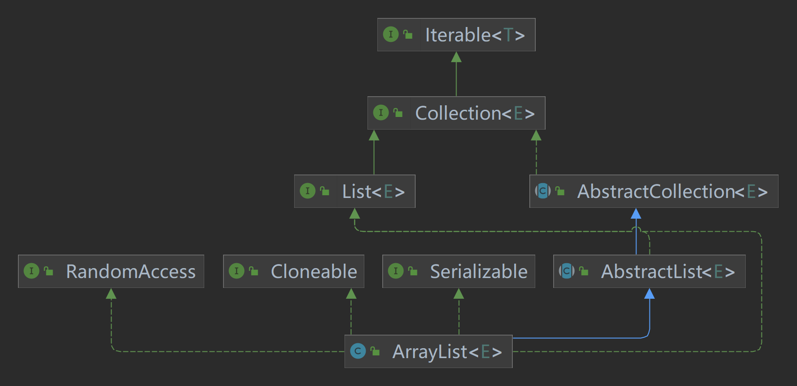
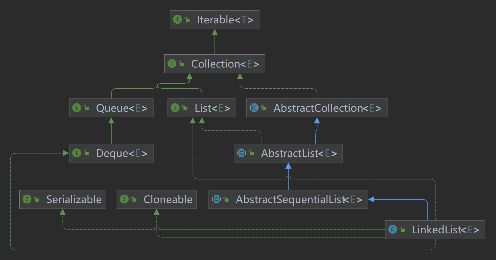
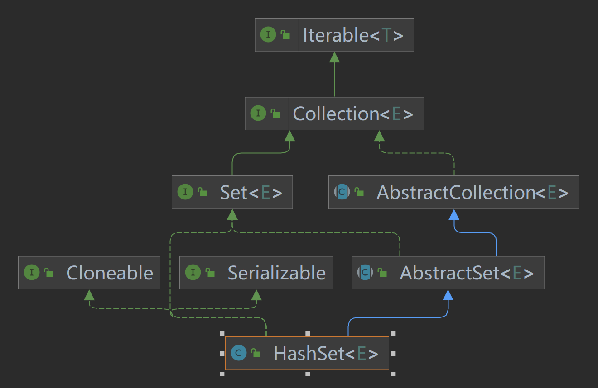
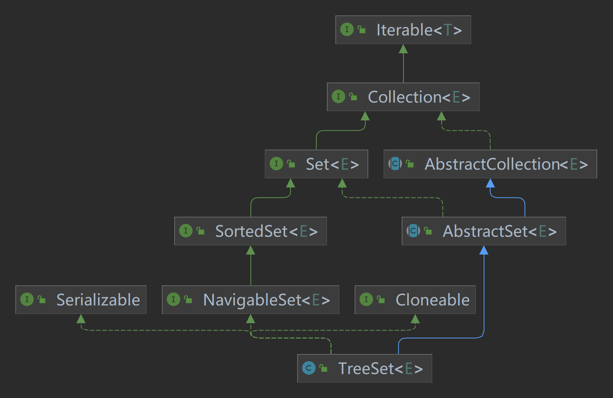
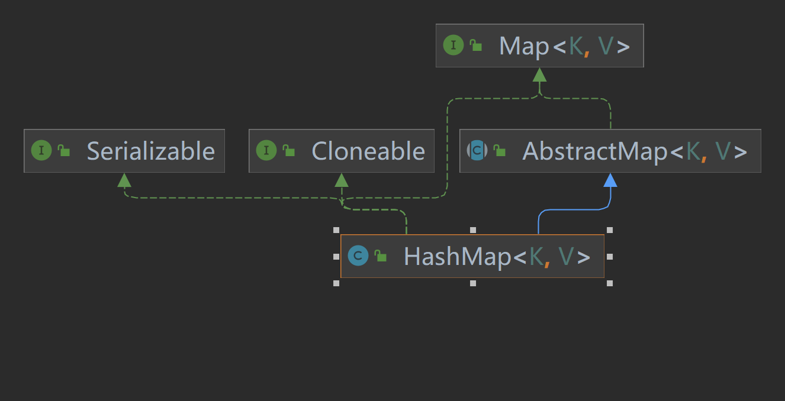

# 一、思维导图

[Java集合框架.xmind](https://www.yuque.com/attachments/yuque/0/2024/xmind/227879/1709105148194-5f1d05c4-22cf-45fc-a684-f0a2c6c1ddef.xmind)

# 二、知识点及实践

## 2.1、Collection

1. **List**

列表（元素有序并且可以重复的集合，被称为序列）

      1. ArrayList

   - 排列有序，可重复
   - 底层使用数组
   - 查询快，增删慢
   - 线程不安全
   - 当容量不够时，ArrayList是当前容量*1.5+1



      2. LinkedList

   - 排列有序，可重复
   - 底层使用双向循环链接数据结构
   - 查询慢，增删快
   - 线程不安全



      3. Vector

   - 排列有序，可重复
   - 底层使用数组
   - 查询快，增删慢
   - 线程安全，效率低
   - 当容量不够时，Vector是当前容量1

      4. Stack

   - 栈是Vector的一个子类，它实现了一个标准的后进先出的栈

2.  **Set**

集合（不能加入重复元素，无序）

      1. HashSet

   - 排列无序，不可重复
   - 底层使用Hash表实现
   - 存取速度快
   - 内部是HashMap



```java
public class SetData {
    public static void main(String[] args) {
        List<String> list = List.of("a", "b", "c", "a");
        Set<String> stringSet = new HashSet<>();
        stringSet.addAll(list);

        // 输出Set集合
        stringSet.forEach(System.out::println);


        SortedSet<String> strings = new TreeSet<>(Set.of("a", "b", "c", "d", "e", "f"));
        SortedSet<String> subSet = strings.subSet("aa", "d");
        System.out.println("sub set = " + subSet);


        List<String> strings1 = new ArrayList<>(Arrays.asList("0", "1", "2", "3", "4"));
        List<String> immutableStrings = Collections.unmodifiableList(strings1);
        System.out.println(immutableStrings);
        strings.add("5");
        System.out.println(immutableStrings);

    }
}
```

      2. TreeSet

   - 排列无序，不可重复
   - 底层使用二叉树实现
   - 排序存储
   - 内部是TreeMap的SortedSet



      3. LinkedHashSet

   - 采用hash表存储，并用双向链表记录插入顺序
   - 内部是LinkedHashMap

3. Queue

在两端出入的List，所以也可以用数组或链表来实现

## 2.2、Map

1. HashMap

- Map提供了一种映射关系，其中的元素是以键值对（key-value）的形式存储的，能够实现根据key快速查找value
- Map中的键值对以Entry类型的对象实例形式存在
- 键（key值）不可重复，value值可以
- 每个建最多只能映射到一个值
- Map接口提供了分别返回key值集合、value值集合以及Entry（键值对）集合的方法
- Map支持泛型，形式如：Map<K,V>



```java
Map<Integer, String> map = new HashMap<>();

map.put(1, "one");
map.put(2, "two");
map.put(3, "three");
map.put(4, "four");
map.put(5, "five");
map.put(6, "six");

Set<Integer> keys = map.keySet();
System.out.println("keys = " + keys);

Collection<String> values = map.values();
System.out.println("values = " + values);

Set<Map.Entry<Integer, String>> entries = map.entrySet();
System.out.println("entries = " + entries);

// lambda表达式写法
map.forEach((k, v)-> System.out.println("key = " + k + ", value = " + v));

map.replaceAll((k,v)->v.toUpperCase());
map.forEach((k, v)-> System.out.println("key = " + k + ", value = " + v));
```

2. HashTable

- 键不可重复，值可重复
- 底层哈希表
- 线程安全
- key、value都不允许

3. TreeMap

- 键不可重复，值可以重复
- 底层二叉树

## 2.3、工具类

1. Iterator迭代器
2. Enumeration枚举类
3. Arrays
4. Collections

# 三、相关扩展

## 3.1、HashMap工作原理及实现

### 3.1.1、概述

什么时候会使用HashMap？他有什么特点？你知道HashMap的工作原理吗？你知道get和put的原理吗？equals()和hashCode()的都有什么作用？你知道hash的实现吗？为什么要这样实现？如果HashMap的大小超过了负载因子(load factor)定义的容量，怎么办？

```java
public static void main(String[] args) {
    HashMap<String, Integer> map = new HashMap<String, Integer>();
    map.put("语文", 1);
    map.put("数学", 2);
    map.put("英语", 3);
    map.put("历史", 4);
    map.put("政治", 5);
    map.put("地理", 6);
    map.put("生物", 7);
    map.put("化学", 8);
    for (Entry<String, Integer> entry : map.entrySet()) {
        System.out.println(entry.getKey() + ": " + entry.getValue());
    }

}
```

### 3.1.2、两个重要的参数

在HashMap中有两个很重要的参数，容量(Capacity)和负载因子(Load factor)
简单的说，Capacity就是bucket的大小，Load factor就是bucket填满程度的最大比例。如果对迭代性能要求很高的话不要把capacity设置过大，也不要把load factor设置过小。当bucket中的entries的数目大于capacity*load factor时就需要调整bucket的大小为当前的2倍。
**Initial capacity** The capacity is **the number of buckets** in the hash table, The initial capacity is simply the capacity at the time the hash table is created.**Load factor** The load factor is **a measure of how full the hash table is allowed to get** before its capacity is automatically increased.

### 3.1.3、put函数的实现

put函数大致的思路为：对key的hashCode()做hash，然后再计算index;如果没碰撞直接放到bucket里；
如果碰撞了，以链表的形式存在buckets后；如果碰撞导致链表过长(大于等于TREEIFY_THRESHOLD)，就把链表转换成红黑树；
如果节点已经存在就替换old value(保证key的唯一性)如果bucket满了(超过load factor*current capacity)，就要resize。

```java
public V put(K key, V value) {
    // 对key的hashCode()做hash
    return putVal(hash(key), key, value, false, true);
}

final V putVal(int hash, K key, V value, boolean onlyIfAbsent,
               boolean evict) {
    Node<K,V>[] tab; Node<K,V> p; int n, i;
    // tab为空则创建
    if ((tab = table) == null || (n = tab.length) == 0)
        n = (tab = resize()).length;
    // 计算index，并对null做处理
    if ((p = tab[i = (n - 1) & hash]) == null)
        tab[i] = newNode(hash, key, value, null);
    else {
        Node<K,V> e; K k;
        // 节点存在
        if (p.hash == hash &&
            ((k = p.key) == key || (key != null && key.equals(k))))
            e = p;
            // 该链为树
        else if (p instanceof TreeNode)
            e = ((TreeNode<K,V>)p).putTreeVal(this, tab, hash, key, value);
            // 该链为链表
        else {
            for (int binCount = 0; ; ++binCount) {
                if ((e = p.next) == null) {
                    p.next = newNode(hash, key, value, null);
                    if (binCount >= TREEIFY_THRESHOLD - 1) // -1 for 1st
                        treeifyBin(tab, hash);
                    break;
                }
                if (e.hash == hash &&
                    ((k = e.key) == key || (key != null && key.equals(k))))
                    break;
                p = e;
            }
        }
        // 写入
        if (e != null) { // existing mapping for key
            V oldValue = e.value;
            if (!onlyIfAbsent || oldValue == null)
                e.value = value;
            afterNodeAccess(e);
            return oldValue;
        }
    }
    ++modCount;
    // 超过load factor*current capacity，resize
    if (++size > threshold)
        resize();
    afterNodeInsertion(evict);
    return null;
}
```

### 3.1.4、get函数的实现

在理解了put之后，get就很简单了。大致思路如下：bucket里的第一个节点，直接命中；如果有冲突，则通过key.equals(k)去查找对应的entry若为树，则在树中通过key.equals(k)查找，O(logn)；若为链表，则在链表中通过key.equals(k)查找，O(n)。具体代码的实现如下

```java
public V get(Object key) {
Node<K, V> e;
return (e = getNode(hash(key), key)) == null ? null : e.value;
}

final Node<K, V> getNode(int hash, Object key) {
    Node<K, V>[] tab;
    Node<K, V> first, e;
    int n;
    K k;
    if ((tab = table) != null && (n = tab.length) > 0 &&
        (first = tab[(n - 1) & hash]) != null) {
        // 直接命中
        if (first.hash == hash && // always check first node
            ((k = first.key) == key || (key != null && key.equals(k))))
            return first;
        // 未命中
        if ((e = first.next) != null) {
            // 在树中get
            if (first instanceof TreeNode)
                return ((TreeNode<K, V>) first).getTreeNode(hash, key);
            // 在链表中get
            do {
                if (e.hash == hash &&
                    ((k = e.key) == key || (key != null && key.equals(k))))
                    return e;
            } while ((e = e.next) != null);
        }
    }
    return null;
}
```

### 3.1.5、hash函数的实现

在get和put的过程中，计算下标时，先对hashCode进行hash操作，然后再通过hash值进一步计算下标，如下图所示在对hashCode()计算hash时具体实现是这样的：

```java
static final int hash(Object key) {
    int h;
return (key == null) ? 0 : (h = key.hashCode()) ^ (h >>> 16);
}
```

之前已经提过，在获取HashMap的元素时，基本分两步：首先根据hashCode()做hash，然后确定bucket的index；如果bucket的节点的key不是我们需要的，则通过keys.equals()在链中找。在Java 8之前的实现中是用链表解决冲突的，在产生碰撞的情况下，进行get时，两步的时间复杂度是O(1)+O(n)。因此，当碰撞很厉害的时候n很大，O(n)的速度显然是影响速度的。因此在Java 8中，利用红黑树替换链表，这样复杂度就变成了O(1)+O(logn)了，这样在n很大的时候，能够比较理想的解决这个问题

### 3.1.6、resize的实现

当put时，如果发现目前的bucket占用程度已经超过了Load Factor所希望的比例，那么就会发生resize。在resize的过程，简单的说就是把bucket扩充为2倍，之后重新计算index，把节点再放到新的bucket中。resize的注释是这样描述的：
大致意思就是说，当超过限制的时候会resize，然而又因为我们使用的是2次幂的扩展(指长度扩为原来2倍)，所以，元素的位置要么是在原位置，要么是在原位置再移动2次幂的位置。怎么理解呢？例如我们从16扩展为32时，具体的变化如下所示：
因此元素在重新计算hash之后，因为n变为2倍，那么n-1的mask范围在高位多1bit(红色)，因此新的index就会发生这样的变化：
因此，我们在扩充HashMap的时候，不需要重新计算hash，只需要看看原来的hash值新增的那个bit是1还是0就好了，是0的话索引没变，是1的话索引变成“原索引+oldCap”。可以看看下图为16扩充为32的resize示意图：
这个设计确实非常的巧妙，既省去了重新计算hash值的时间，而且同时，由于新增的1bit是0还是1可以认为是随机的，因此resize的过程，均匀的把之前的冲突的节点分散到新的bucket了。下面是代码的具体实现：

```java
final Node<K,V>[] resize() {
    Node<K,V>[] oldTab = table;
    int oldCap = (oldTab == null) ? 0 : oldTab.length;
    int oldThr = threshold;
    int newCap, newThr = 0;
    if (oldCap > 0) {
        // 超过最大值就不再扩充了，就只好随你碰撞去吧
        if (oldCap >= MAXIMUM_CAPACITY) {
            threshold = Integer.MAX_VALUE;
            return oldTab;
        }
            // 没超过最大值，就扩充为原来的2倍
        else if ((newCap = oldCap << 1) < MAXIMUM_CAPACITY &&
                 oldCap >= DEFAULT_INITIAL_CAPACITY)
            newThr = oldThr << 1; // double threshold
    }
    else if (oldThr > 0) // initial capacity was placed in threshold
        newCap = oldThr;
    else { // zero initial threshold signifies using defaults
        newCap = DEFAULT_INITIAL_CAPACITY;
        newThr = (int)(DEFAULT_LOAD_FACTOR * DEFAULT_INITIAL_CAPACITY);
    }
    // 计算新的resize上限
    if (newThr == 0) {

        float ft = (float)newCap * loadFactor;
        newThr = (newCap < MAXIMUM_CAPACITY && ft < (float)MAXIMUM_CAPACITY ?
                  (int)ft : Integer.MAX_VALUE);
    }
    threshold = newThr;
    @SuppressWarnings({"rawtypes","unchecked"})
    Node<K,V>[] newTab = (Node<K,V>[])new Node[newCap];
    table = newTab;
    if (oldTab != null) {
        // 把每个bucket都移动到新的buckets中
        for (int j = 0; j < oldCap; ++j) {
            Node<K,V> e;
            if ((e = oldTab[j]) != null) {
                oldTab[j] = null;
                if (e.next == null)
                    newTab[e.hash & (newCap - 1)] = e;
                else if (e instanceof TreeNode)
                    ((TreeNode<K,V>)e).split(this, newTab, j, oldCap);
                else { // preserve order
                    Node<K,V> loHead = null, loTail = null;
                    Node<K,V> hiHead = null, hiTail = null;
                    Node<K,V> next;
                    do {
                        next = e.next;
                        // 原索引
                        if ((e.hash & oldCap) == 0) {
                            if (loTail == null)
                                loHead = e;
                            else
                                loTail.next = e;
                            loTail = e;
                        }
                            // 原索引+oldCap
                        else {
                            if (hiTail == null)
                                hiHead = e;
                            else
                                hiTail.next = e;
                            hiTail = e;
                        }
                    } while ((e = next) != null);
                    // 原索引放到bucket里
                    if (loTail != null) {
                        loTail.next = null;
                        newTab[j] = loHead;
                    }
                        // 原索引+oldCap放到bucket里
                        if (hiTail != null) {
                            hiTail.next = null;
                            newTab[j + oldCap] = hiHead;
                        }
                    }
                }
            }
        }
        return newTab;
    }
```

### 3.1.7、总结

我们现在可以回答开始的几个问题，加深对HashMap的理解：
**1. 什么时候会使用HashMap？他有什么特点？**
是基于Map接口的实现，存储键值对时，它可以接收null的键值，是非同步的，HashMap存储着Entry(hash, key, value, next)对象。
**2. 你知道HashMap的工作原理吗？**
通过hash的方法，通过put和get存储和获取对象。存储对象时，我们将K/V传给put方法时，它调用hashCode计算hash从而得到bucket位置，进一步存储，HashMap会根据当前bucket的占用情况自动调整容量(超过Load Facotr则resize为原来的2倍)。获取对象时，我们将K传给get，它调用hashCode计算hash从而得到bucket位置，并进一步调用equals()方法确定键值对。如果发生碰撞的时候，Hashmap通过链表将产生碰撞冲突的元素组织起来，在Java 8中，如果一个bucket中碰撞冲突的元素超过某个限制(默认是8)，则使用红黑树来替换链表，从而提高速度。
**3. 你知道get和put的原理吗？equals()和hashCode()的都有什么作用？**

通过对key的hashCode()进行hashing，并计算下标( n-1 & hash)，从而获得buckets的位置。如果产生碰撞，则利用key.equals()方法去链表或树中去查找对应的节点

**4.你知道hash的实现吗？为什么要这样实现？**
在Java 1.8的实现中，是通过hashCode()的高16位异或低16位实现的：(h = k.hashCode()) ^ (h >>> 16)，主要是从速度、功效、质量来考虑的，这么做可以在bucket的n比较小的时候，也能保证考虑到高低bit都参与到hash的计算中，同时不会有太大的开销。
**5. 如果HashMap的大小超过了负载因子(load factor)定义的容量，怎么办？**如果超过了负载因子(默认0.75)，则会重新resize一个原来长度两倍的HashMap，并且重新调用hash方法。
以Entry[]数组实现的哈希桶数组，用Key的哈希值取模桶数组的大小可得到数组下标。插入元素时，如果两条Key落在同一个桶(比如哈希值1和17取模16后都属于第一个哈希桶)，Entry用一个next属性实现多个Entry以单向链表存放，后入桶的Entry将next指向桶当前的Entry。查找哈希值为17的key时，先定位到第一个哈希桶，然后以链表遍历桶里所有元素，逐个比较其key值。当Entry数量达到桶数量的75%时(很多文章说使用的桶数量达到了75%，但看代码不是)，会成倍扩容桶数组，并重新分配所有原来的Entry，所以这里也最好有个预估值。取模用位运算(hash & (arrayLength-1))会比较快，所以数组的大小永远是2的N次方， 你随便给一个初始值比如17会转为32。默认第一次放入元素时的初始值是16。iterator()时顺着哈希桶数组来遍历，看起来是个乱序。在JDK8里，新增默认为8的閥值，当一个桶里的Entry超过閥值，就不以单向链表而以红黑树来存放以加快Key的查找速度。

# 四、参考资料

[https://dev.java/learn/api/collections-framework/](https://dev.java/learn/api/collections-framework/)